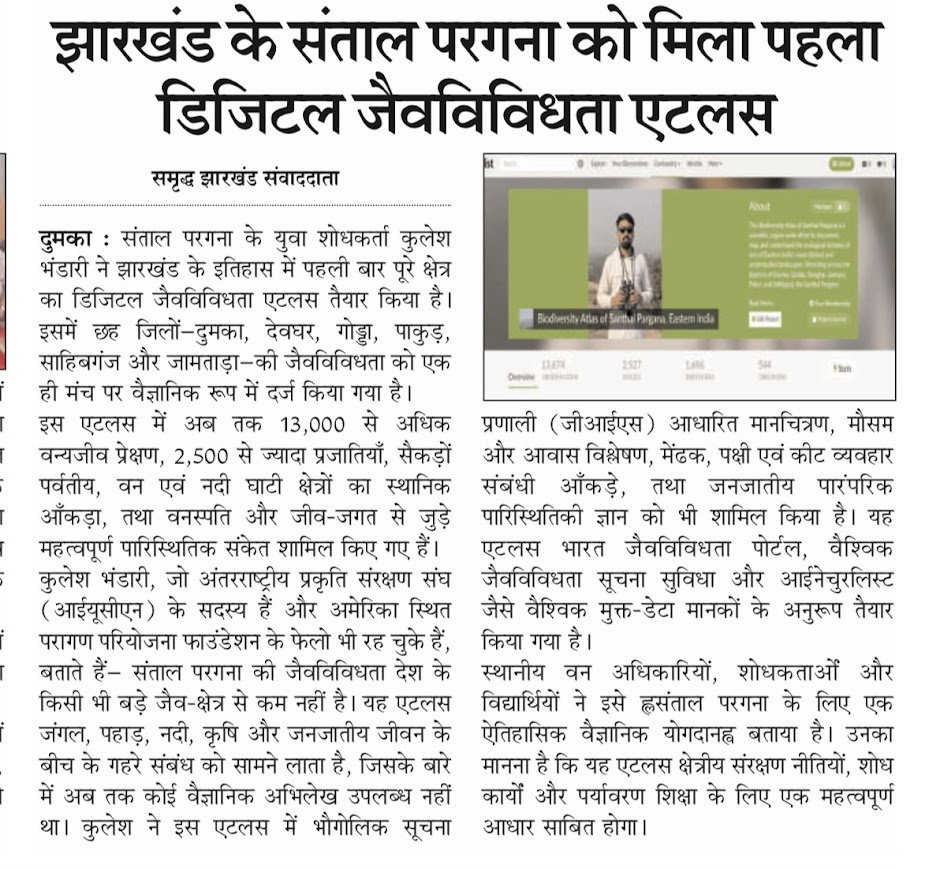

  

# Biodiversity-Atlas-of-Santhal-Pargana

Open-access biodiversity atlas documenting species diversity, ecological observations, and community-linked landscape data across the tribal uplands, sal forests, wetlands, and granite outcrop ecosystems of Santhal Pargana, Eastern India, through citizen science, field ecology, and biodiversity informatics.

## Overview

The Biodiversity Atlas of Santhal Pargana is a regional open-access biodiversity documentation initiative focused on the tribal uplands and forest landscapes of Eastern India.

The atlas integrates:

* Citizen-science observations
* Ecological field records
* Species occurrence data
* Landscape-level biodiversity documentation
* Indigenous ecological knowledge

Current coverage includes sal forests, wetlands, riparian systems, agroforestry landscapes, and granite outcrop ecosystems across the Santhal Pargana region of Jharkhand.

## Current Dataset

* 14,000+ biodiversity observations
* 2,500+ documented species
* 1,700+ identifiers and taxonomic contributors
* 500+ observers and citizen-science participants

### Spatial Coverage of Biodiversity Observations

Heatmap visualization showing biodiversity observation density across the Santhal Pargana landscape based on citizen-science records and ecological field documentation.

## Platforms & Links

### iNaturalist

https://www.inaturalist.org/projects/biodiversity-atlas-of-santhal-pargana-eastern-india

### India Biodiversity Portal

https://indiabiodiversity.org/group/Biodiversity_Atlas_of_Santhal_Pargana/show

## Objectives

* Strengthen regional biodiversity documentation
* Support open-access ecological research
* Promote citizen-science participation
* Build long-term biodiversity datasets for Eastern India
* Support conservation awareness and ecological literacy

## Media & Recognition

### Regional News Coverage

**“Santhal Pargana Receives Its First Digital Biodiversity Atlas”**
Regional newspaper coverage highlighting the Biodiversity Atlas of Santhal Pargana as one of the first large-scale open-access biodiversity documentation initiatives from the tribal uplands of Eastern India.

## Founder & Curator

Kulesh Bhandari
Biodiversity Researcher | Community-led Conservation & Ecological Mapping
Member – IUCN Commission on Ecosystem Management | Association for Tropical Biology and Conservation | Global Youth Biodiversity Network
